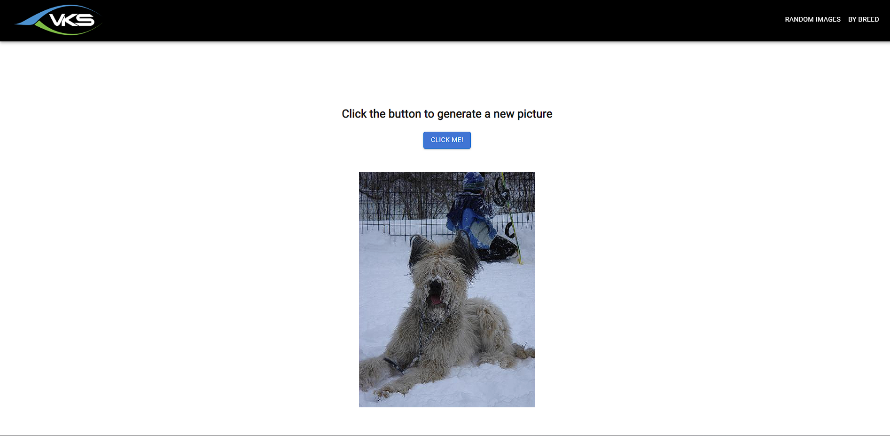
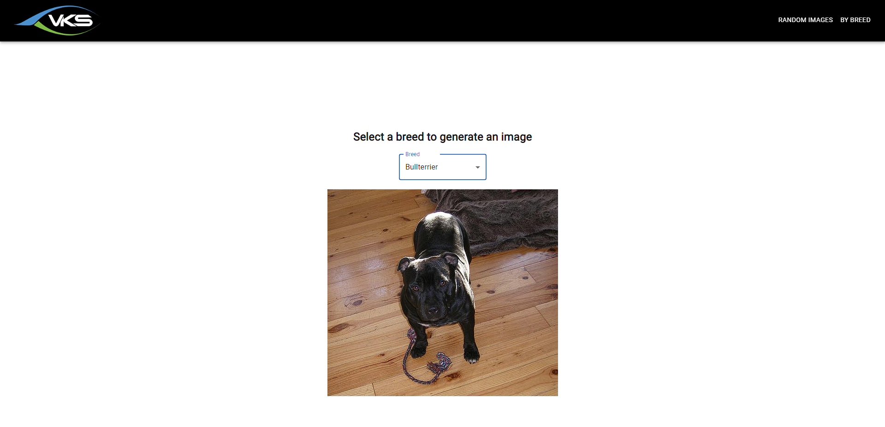

# Dog Fun App

This application generate random images of dog. Also generate some random images by selecting breed. 

There are two sub-directory for project.


## Project Directory

 - [Dog Client](https://awesomeopensource.com/project/elangosundar/awesome-README-templates)
 - [Dog Server](https://github.com/matiassingers/awesome-readme)


## Client Side Feature

- Basic UI using material ui react.
- Random image generate by click on button.
- Display breed list on page load and when select any breed display random image of selected breed.
- APIs call to server to get random images.


## Server Side Feature

- Server configuration to run.
- Cors policy apply.
- Epxress framework use to build APIs.
- Call controller and send response to Client.


## Run Project

Open dog-server folder and run below command

```bash
  npm run serve
```

Open dog-client folder and run below command
 
```bash
  npm start
```

## Screenshots





